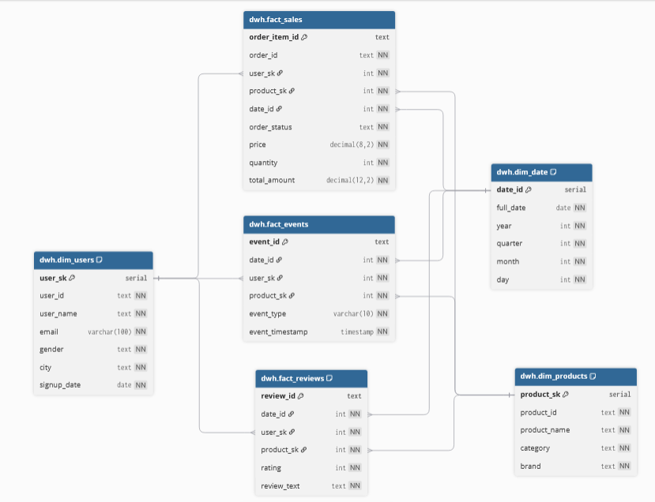

# Анализ e-commerce: построение DWH и дашборда

## Описание проекта

В рамках проекта был разработан аналитический пайплайн для e-commerce данных: 
от загрузки CSV в базу данных PostgreSQL до построения витрин и BI-дашборда.

Реализовано хранилище данных (DWH), выполнен анализ продаж, товаров и клиентов, 
включая ABC/XYZ анализ, когортный анализ пользователей и RFM анализ.

## Цель проекта

Построить аналитическую систему для e-commerce бизнеса, включающую:

- разработку хранилища данных (DWH)
- построение ETL-пайплайна
- анализ продаж, ассортимента и клиентского поведения
- создание BI-дашборда для мониторинга ключевых метрик

## Структура проекта

```
e-com-analyze-project/
├── config/                         
|   ├── .env                        # переменные окружения (скрыт)                    
|   ├── log_config.py               # настройка логирования
|   └── settings.py                 # загрузка конфигурации
|
├── datalens/
│   └── E-commerce.json             # бэкап для DataLens
|
├── img/                            # скриншоты
│   ├── 01. Анализ продаж.png       # вкладка "Продажи"
│   ├── 02. Анализ товаров.png      # вкладка "Товары"
|   ├── 03. Анализ покупателей.png  # вкладка "Покупатели"
|   └── dwh.png                     # схема хранилища данных (звезда)
|
├── ecommerce_dataset/
│   ├── events.csv                  # пользовательские события
│   ├── order_items.csv             # товары в заказах
│   ├── orders.csv                  # заказы
│   ├── products.csv                # каталог товаров
│   ├── reviews.csv                 # отзывы пользователей
│   └── users.csv                   # информация о пользователях
|
├── log/                            
│   └── etl.log                     # лог загрузки данных (создаётся автоматически)
|
├── python/
|   ├── etl.py                      # основной скрипт: загрузка csv → staging (PostgreSQL)
│   ├── pgdb.py                     # модуль подключения к БД
│   └── pgdbrequirements.txt        # зависимости
|
├── sql/                            
│   ├── DDL_DWH.sql                 # создание dwh
│   ├── DDL_STG.sql                 # создание staging слоя (raw таблицы)
│   └── from_stg_to_dwh.sql         # загрузка данных из staging → dwh
|
├── .gitignore
└── README.md                       # документация
```

## Данные

Источник: [E-commerce_dataset](https://www.kaggle.com/datasets/abhayayare/e-commerce-dataset)

Состав данных:
- users.csv — информация о пользователях
- products.csv — каталог товаров
- orders.csv — заказы
- order_items.csv — товары в заказах
- events.csv — действия пользователей
- reviews.csv — отзывы клиентов о продуктах

## Архитектура проекта
```
CSV файлы
   ↓
ETL (Python: sqlalchemy, pandas, logging)
   ↓
PostgreSQL (Staging слой)
   ↓
PostgreSQL (DWH)
   ↓
DataLens (дашборд, QL-чарты)
```

## Модель данных (DWH)

Использована схема "звезда"



## Подключение к БД для DataLens

Для проекта была выбрана СУБД PostgreSQL.
БД размещена на сервисе Supabase.

Доступ:
- Host: aws-1-ap-south-1.pooler.supabase.com
- Port: 5432
- Name: postgres
- User: dwh_user.tmxewoslynmomrsljuyz
- Password: dwhuser
- Права: SELECT (только чтение)

## Ссылка на дашборд
[Дашборд в Yandex DataLens](https://datalens.yandex/ojwktfbofqn88)

## Дашборд

[Анализ продаж](img/01.%20Анализ%20продаж.png)
[Анализ товаров](img/02.%20Анализ%20товаров.png)
[Анализ покупателей](img/03.%20Анализ%20покупателей.png)

## Ключевые инсайты

- Большинство пользователей совершает только одну покупку (**ARPPU ≈ AOV**)
- *Retention* пользователей крайне низкий (**<5%**), что указывает на слабую клиентскую лояльность
- Товары из группы *AZ* генерят больше всего прибыли, но имеют нестабильный спрос
- Больше половины всей вуручки приноясят товары двух категорий (Электроника, Авто)
- Бизнес в большей степени зависит от привлечения новых клиентов, чем от удержания существующих

## Как запустить проект

1. Установить зависимости:
   pip install -r python/requirements.txt

2. Настроить подключение к БД (config/settings.py)

3. Выполнить SQL-скрипты:
   - DDL_STG.sql
   - DDL_DWH.sql

4. Запустить ETL:
   python python/etl.py

5. Выполнить загрузку в DWH:
   sql/from_stg_to_dwh.sql

6. Подключить DataLens к БД